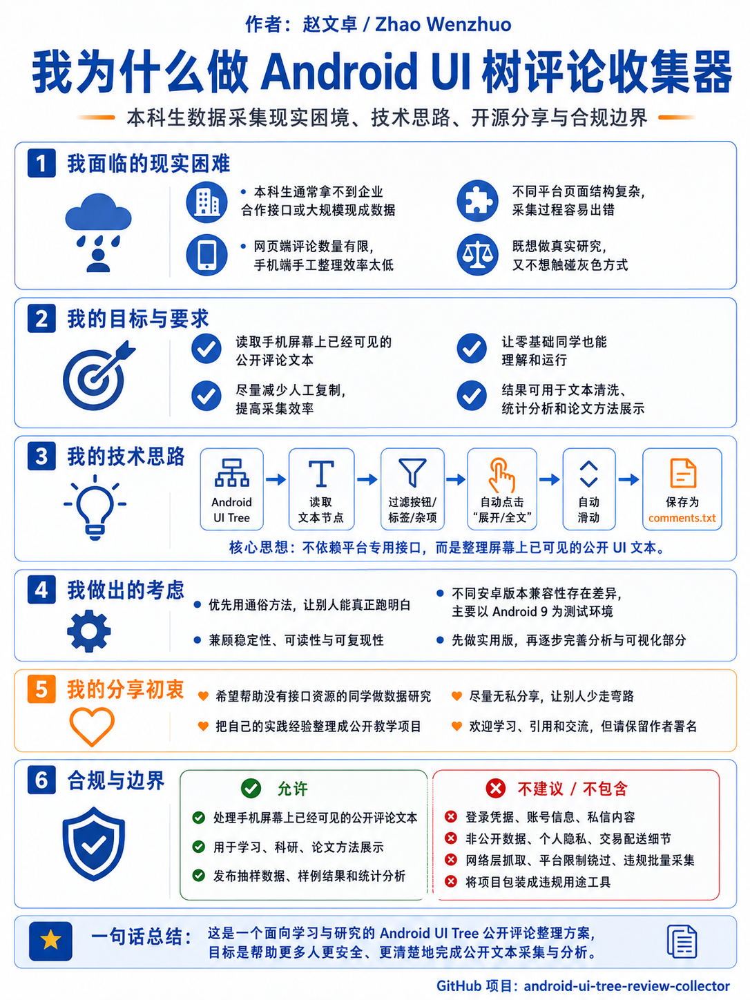
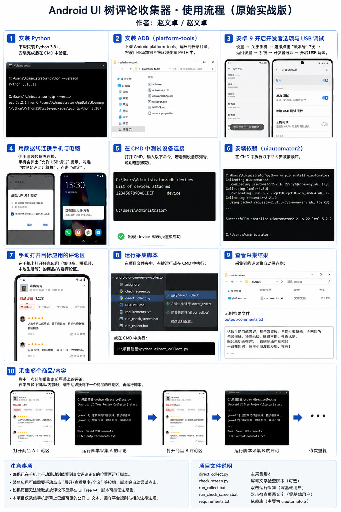
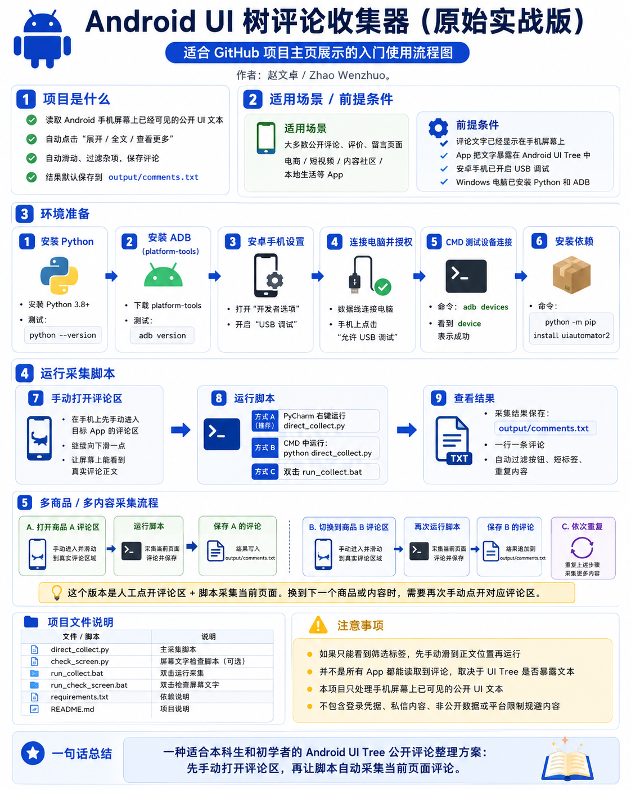

# Android UI Tree Review Collector

作者：赵文卓 / Zhao Wenzhuo

## 项目宣传图

<p align="center">
  
</p>

## 使用流程图

<p align="center">
  
</p>

<p align="center">
  
</p>

打开任意 Android App 的公开评论区，运行 `direct_collect.py`，脚本会自动点击“展开/查看更多”、自动滑动、过滤页面杂项，并把评论按一行一条保存到 `output/comments.txt`。

## 适用范围

适用于大多数 Android App 的公开评论、评价、留言、反馈页面，例如电商、短视频、本地生活、内容社区等。

前提是：

- 评论文字已经显示在手机屏幕上；
- App 把这些文字暴露在 Android UI Tree 中；
- 手机已开启 USB 调试并允许电脑调试。

不适用于：

- 完全不暴露 UI Tree 文本的页面；
- 图片/OCR 才能识别的评论；
- 需要登录权限以外的数据；
- 非公开聊天、私密内容或账号数据。

## 文件说明

```text
direct_collect.py        主采集脚本，PyCharm 里右键运行它
check_screen.py          屏幕文字检查脚本，先看电脑能读到什么
run_collect.bat          双击运行采集，给零基础用户用
run_check_screen.bat     双击检查屏幕文字，给零基础用户用
requirements.txt         依赖库，只需要 uiautomator2
.gitignore               防止上传 output、缓存和 pyc
LICENSE                  MIT 开源许可证
NOTICE                   作者和公开版说明
```

## 最推荐用法

1. 安卓手机连接电脑。
2. 手机开启 USB 调试，并允许这台电脑调试。
3. 手动打开任意 App 的评论区。
4. 手动往下滑一点，让屏幕上能看到真实评论正文。
5. 用 PyCharm 打开并运行：

```text
direct_collect.py
```

采集结果会保存到：

```text
output/comments.txt
```

## 第一次使用先安装依赖

```bash
pip install -r requirements.txt
```

或：

```bash
python -m pip install uiautomator2
```

## 先检查页面能不能读

如果你不确定当前页面能不能被读取，先运行：

```text
check_screen.py
```

它会生成：

```text
output/screen_all_text.txt
output/screen_candidate_comments.txt
```

如果 `screen_all_text.txt` 里只有“全部、好评、差评、口感很好、日期新鲜”这些筛选标签，说明你停在评论区顶部，请手动往下滑到正文位置再运行。

## 可直接改的参数

在 `direct_collect.py` 顶部可以直接改：

```python
OUTPUT_FILE = Path("output/comments.txt")
MAX_ITEMS = 2000
MIN_COMMENT_CHARS = 4
```

想先试跑 50 条，就改成：

```python
MAX_ITEMS = 50
```

## 项目边界

本项目只处理手机屏幕上已经可见的公开 UI 文本。它不包含网络层数据采集、平台限制规避、登录凭据、个人联系信息或非公开数据采集内容。使用者应遵守目标平台服务条款、当地法律法规和研究伦理要求。
